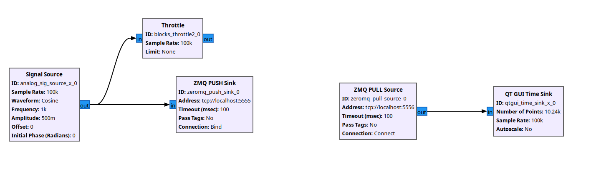

# gr4-block-tutorial

This repo is designed to show how to create simple blocks in GR4.  Another good reference is also this tutorial given by Alex Krimm at [EU GR Days 2024](https://www.youtube.com/live/ce496ZCwlqA?si=u0hhU2i_57sJbWty&t=1121) 

## Setup and build


```
cd gr4-block-tutorial
docker run -it -v `pwd`:/code ghcr.io/mormj/gr4-oot-env:latest bash # this defaults to the /code directory
meson setup build
cd build
ninja
ninja test
```

For convenience this repository also contains a vscode devcontainer that points to this docker image


### Why do we use meson in this repo?

Mainly, because it's easier to work with than CMake and doesn't need to match what the rest of GR4 uses, since that is "packaged" and installed in the container. Meson lowers the bar for build system understanding since the purpose of this tutorial is to learn the basics of writing blocks.  


## GR3 Flowgraphs
For testing we will be pushing samples and packets to and from GNU Radio 3.x using ZMQ push and pull blocks.  The supporting flowgraphs are contained in the gr3_grc folder.  The `gr4-oot-env` container contains some basic ZMQ blocks and a PMT converter for GR4 from `github.com/gnuradio/gr4-incubator` which is the proving ground for future official blocks

### ZMQ Streaming

`zmq_streaming_signal.grc` sends out a source of complex samples from a ZMQ Push Sink (which will be recieved by the GR4 flowgraph). The expected return is a stream of complex samples.  



### ZMQ Packets
`zmq_packet_signal_loopback.grc` sends out a source of complex samples from a ZMQ Push Sink (which will be recieved by the GR4 flowgraph).  The expected return are PMT vectors of complex samples.


## OOT Structure

This structure is subject to change, but for now all blocks will live in `blocks/tutorial/include/gnuradio-4.0/tutorial`

Example flowgraphs will live in `blocks/tutorial/examples`

QA tests will live in `blocks/tutorial/test/`

## Lesson 1:  Our first block

### Creating the block

Create a new file under `[ROOT]/blocks/tutorial/include/gnuradio-4.0/tutorial` called `Square.hpp`

Let's go ahead and code the most basic of blocks


```c++
#pragma once

#include <gnuradio-4.0/Block.hpp>
#include <gnuradio-4.0/BlockRegistry.hpp>


namespace gr::tutorial {

struct Square : Block<Square> {

    using Description = Doc<"@brief Squares the input value">;

    PortIn<float> in;
    PortOut<float> out;

    GR_MAKE_REFLECTABLE(Square, in, out);

    [[nodiscard]] constexpr float processOne(float input) const noexcept { return input*input; }
};

} // namespace gr::tutorial


GR_REGISTER_BLOCK(gr::tutorial::Square, [ float, short, std::complex<float> ])
```

### What should we notice:

1) Curiously recurring template pattern (CRTP)

Block is declared as derived from type `Block` with template parameter `Square`.  This design pattern allows the framework to use concrete type (Square) to generate metadata, default behaviors, and connect the scheduler hooks.

2) Docs are baked in

The `Description` statement can be used at compilation to automatically generate docs 

3) Ports

In GR4, ports are a first class type, and are defined at compile time strongly typed.  This is a key difference between GR3 and GR4 where in GR3 the ports are very general buffers of `void *` data.  

4) Reflection

A convenience macro takes in all the elements of the block that should be registered (ports, parameters) with the reflection system.  This will allow runtime changes to parameter via PMTs without further coding in the simplest cases

5) New ways of doing work

For this block, the simplest (and most preferred) method for defining the `work` that the block does - the `processOne` function.  This can only be used for block constructions that are single input, single output, non-decimating or interpolating.  But it allows the compiler to build this into higher loops that better match the scheduling or optimization constraints.

```c++
[[nodiscard]] constexpr float processOne(float input) const noexcept { return input*input; }
```

`constexpr` - enables compile-time evaluation when possible; also signals triviality.
`noexcept` - promises not to throw (lets the scheduler stay lean).
`[[nodiscard]]` - catches mistakes if someone calls it and ignores the result.

This method takes in one `float` input value, and returns one `float` output value.  Because it is pure & stateless → easy to reason about, test, and parallelize.  This will allow the runtime to:
  - pipeline across threads
  - fuse it with adjacent ops (merge API)
  - vectorize it trivially


6) Plugin Registration

We will go into more detail about this later, but basically this is a statement that is ignored by the compiler (the macro is empty), but used by postprocessing tools to code generate runtime wrappers for strongly typed instantiations of this block


### Using this in a flowgraph

In the `examples` folder, there is a file called `zmq_loopback.cpp` that receives the ZMQ stream from GR3, runs it through a `Copy` block, then sends it back.  Let's go ahead and see this behavior, then we'll copy over the flowgraph to a new file, swap out for our block and work from there.

The zmq_loopback application should already be build from when we ran `ninja` before

```
cd build
./blocks/tutorial/examples/zmq_loopback
```

While this is running, our flowgraph is waiting for samples from GR3.  Run the zmq_packet_signal_loopback.grc flowgraph and you will see live samples coming back to the QT Time Sync:


Ctrl-c the GR4 running flowgraph and you will notice that it kills the stream in GR3.  This is now our baseline for demonstrating GR4 flowgraphs

Copy `zmq_loopback.cpp` to `zmq_loopback_square.cpp`.  We need to replace the `Copy` block with our `Square` block.  The code should look like this:

```c++

int main() {

 
    using T = float;

    gr::Graph fg;
    auto&     source = fg.emplaceBlock<gr::zeromq::ZmqPullSource<T>>({
        {"endpoint", "tcp://localhost:5555"},
        {"timeout", 10},
        {"bind", false},
    });

    auto& sink = fg.emplaceBlock<gr::zeromq::ZmqPushSink<T>>({
        {"endpoint", "tcp://localhost:5556"},
        {"timeout", 100},
        {"bind", true},
    });

    auto& squareBlock = fg.emplaceBlock<Square>({
    });


    const char* connection_error = "connection_error";

    // if (fg.connect<"out">(source).to<"in">(sink) != gr::ConnectionResult::SUCCESS) {
    //     throw gr::exception(connection_error);
    // }
    if (fg.connect<"out">(source).to<"in">(squareBlock) != gr::ConnectionResult::SUCCESS) {
        throw gr::exception(connection_error);
    }
    if (fg.connect<"out">(squareBlock).to<"in">(sink) != gr::ConnectionResult::SUCCESS) {
        throw gr::exception(connection_error);
    }


    gr::scheduler::Simple<gr::scheduler::ExecutionPolicy::singleThreaded> sched{std::move(fg)};
    const auto                                                            ret = sched.runAndWait();
    if (!ret.has_value()) {
        std::print("scheduler error: {}", ret.error());
        std::exit(1);
    }

    return 0;
}


```

Also, we need to create the executable - update `meson.build` to make a separate executable for the `Square` version of the zmq loopback

```meson
exe = executable('zmq_loopback_square', 'zmq_loopback_square.cpp',
  install : true,
  include_directories: inc_dirs,
  dependencies: [gr4_dep, gr4_blocklib_dep, pmt_conv_dep, zmq_dep, gr4_zeromq_headers])
```

Compile this with `ninja`, then run `zmq_loopback_square` from the command line.  You will also need to modify the GRC flowgraph to send floats since that is what we hardcoded in the Square block.


## Lesson 2:  Templates

For many blocks, it is necessary to allow it to work over a variety of types.  C++ uses templates to achieve this purpose, so we will update the `Square` block to achieve this purpose

Go back to the Square.hpp - let's template the parameter, so it will square floats, or ints, or whatever type could be defined


Add the template parameter to the class definition:
```c++
template <typename T>
struct Square : Block<Square<T>> {
```

Now, use the template type `T` instead of `float` in the ports and the processOne method

```c++
    PortIn<T> in;
    PortOut<T> out;

    GR_MAKE_REFLECTABLE(Square, in, out);

    [[nodiscard]] constexpr T processOne(T input) const noexcept { return input*input; }
```


Now, when we try and compile, this will fail because our block instantiation in the flowgraph doesn't use the template parameter.

```c++
    auto& squareBlock = fg.emplaceBlock<Square>({
    });
```
becomes
```c++
    auto& squareBlock = fg.emplaceBlock<Square<T>>({
    });
```

`T` should already be defined as float, so recompile and run, and the block should work as before.  Modify it with a different type like `short` and modify the GR3 flowgraph appropriately to reflect this

### SIMD
To use (what will become) std::simd approach to vectorizing the block, we just have to add a template type above the processOne function, and use this new template type `V`

```c++
    template<gr::meta::t_or_simd<T> V>
    [[nodiscard]] constexpr V processOne(V input) const noexcept { return input*input; }
```


## Lesson 3: Parameter Management

### Adding a parameter

A parameter in a GR4 block is just a member variable that gets registered through the reflection management macro.

Let's keep working on our `Square` block, and add a parameter that is an additive offset to go with the square.

```c++
    T offset = 0;

    GR_MAKE_REFLECTABLE(Square, in, out, offset);
```

We just declared a member variable and told the framework to expose this as a reflected parameter.  This means

1) At flowgraph initialization, we can specify this parameter with an initialization value
2) During flowgraph runtime, we can change this parameter by getting a `PMT` to the block (either over a control port, or via tags, or a block method)

Nothing more we have to do to enable this behavior.  The only exception to this is if the parameter drives some change in the underlying behavior of a private variable.


### Annotations

We can indicate a number of things associated with a parameter that get compiled in by wrapping the type of the parameter in the `Annotated` template.

```c++
Annotated<T, "offset", Doc<"additive offset">, Visible, Unit<"dB">>        offset = 0;
```

In this case we are using type T (still), naming the parameter `"offset"`, and documenting what it does.  Also we denote that it is `Visible` to the UI (flag that can be used by a UI application), and giving it a physically meaningful unit.  In this case we put dB - which is not true at the moment, but let's make it that way.


### Parameter Changes

If a parameter change impacts other member variables, we need to catch changes.  In GR4 blocks there is no custom constructor, so parameter changes are all handled through a common handler

Since we decided to define our offset as a dB value (for arbitrary reasons), let's create a private variable that tracks the linear value:

```c++
T _offset_linear;
```

In our `processOne` we need to use this value

```c++
    [[nodiscard]] constexpr V processOne(V input) const noexcept { return input*input + _offset_linear; }
```

And update it whenever the `"Property Map"` is updated with a new value for this property

```c++
    void settingsChanged(const gr::property_map& old_settings, const gr::property_map& new_settings) {
        if (new_settings.contains("offset") && old_settings.at("offset") != new_settings.at("offset")) {
            _offset_linear = pow(T{20},offset/T{10});
        }
    }
```

## Lesson 4: Unit Tests

We should have done this earlier.  But now that we have a functional block, let's add some tests to make sure it stays that way.

In the `test/` folder, create `qa_Square.cpp`

```cpp
#include <boost/ut.hpp>

#include <gnuradio-4.0/tutorial/Square.hpp>
using namespace gr::tutorial;
using namespace boost::ut;

const suite SquareTests = [] {
    "Simple Test"_test = [] {
        auto blk = Square<float>(gr::property_map{
            {"offset", "3.0"},
        });

        float value = 483732.9227;
        float expected = value * value + pow(10.0,3.0/10.0);
        expect(eq(blk.processOne(value), expected)); 
    };

};

int main() { return boost::ut::cfg<boost::ut::override>.run(); }
```

then add the qa_Square into the `meson.build` file

Testing the `processOne` method directly is the easiest way to add qa for a block.  But we can also instantiate a flowgraph to verify functionality.  This adds to compile time, and is usually not necessary.


## Lesson 5: processBulk

Not every block is so simple that we can use a `processOne` function.  `processBulk` is much more similar to the traditional GR3 `work` method.


There are several ways to write a processBulk function, but we will start with the simplest:

```c++
    [[nodiscard]] constexpr work::Status processBulk(std::span<const T> input, std::span<T> output) const noexcept {       
        std::ranges::transform(input, output.begin(), [&](T a){ return a*a + _offset_linear; });

        return work::Status::OK;
    }
```

This does the exact same thing as the `processOne` but is wrapped in std::transform.  It's unnecessary, but shows how the processBulk works.  

We can comment out the `processOne` use this `processBulk`, and update the qa test accordingly (or comment it out)

But when we run the ZMQ flowgraph, we see the same result.


Let's move onto a more interesting usage of processBulk.  In this example, we are going to take multiple streams, add them together, then packetize and send as a PMT.

We will create a new block (can just put it in `Square.hpp`), called `Packetizer`.  Let's take a look at the following code


```c++
template <typename T>
struct Packetizer : Block<Packetizer<T>, Resampling<1024U, 1UZ, false>> {
```

This block uses a new template property to indicate to the compiler that it will act as a resampler.  The resampling ratio is specified at compile time, but as we will see can be changed during runtime.  Other than that the class definition is the same as the `Square` block

```c++
    using Description = Doc<"@brief Packetize the input streams and perform some function">;

    std::vector<PortIn<T>> in;
    PortOut<pmtv::pmt> out;

    size_t n_inputs;
    size_t packet_size;

    GR_MAKE_REFLECTABLE(Packetizer, in, out, n_inputs, packet_size);
```

Here we are going to specify a single output port, but multiple input ports.  This will also change how we define the `processBulk` method as we will see.  We add 2 parameters:

1) Number of inputs, as we want to change this at runtime/instantiation
2) `packet_size` - how many samples are going to be sent in the bursts

```c++
    void settingsChanged(const property_map& old_settings, const property_map& new_settings) noexcept {
        if (new_settings.contains("n_inputs") && old_settings.at("n_inputs") != new_settings.at("n_inputs")) {
            in.resize(n_inputs);
        }

        if (new_settings.contains("packet_size")) {
            this->input_chunk_size = packet_size;
        }
    }
```
Our parameter management allows us to dynamically change the number of input ports, and the decimation ratio - which is a member variable of the base `Block` class available when `Resampling` is specified.  This value `input_chunk_size` specifies for each output sample, how many input samples will be consumed - aka the decimation factor.

```c++
    template<gr::InputSpanLike TInSpan>
    [[nodiscard]] constexpr work::Status processBulk(const std::span<TInSpan>& input, std::span<pmtv::pmt> output) const noexcept {       

        const size_t N = this->input_chunk_size;  // input_chunk_size defines the input to output ratio, i.e. the decimation ratio
        size_t num_chunks = output.size();

        for (size_t idx = 0; idx < num_chunks; ++idx) {
            std::vector<T> out_chunk(N);
            std::copy(input[0].begin()+ idx * N, input[0].begin()+ (idx+1) * N, out_chunk.begin());
            for (std::size_t n = 1; n < input.size(); n++) {
                std::transform(out_chunk.begin(), out_chunk.end(), input[n].begin()+ idx * N, out_chunk.begin(), 
                    [](T a, T b){
                        return a + b;
                    }
                );
            }
            
            output[idx] = pmtv::pmt(std::move(out_chunk));
        }
        return work::Status::OK;
    }

};
```

The `processBulk` method assumes something important which is contracturally guaranteed in the scheduler with a `Resampling` block.  Namely, that the number of available samples to write to the output will be equal to the number of input samples available / `input_chunk_size`.  Remember that `processBulk` is more limited in functionality than a GR3 `general_work` method and is more like the `work` of a sync block.

So all we are doing in this process bulk is accumulating across the inputs in chunks of `input_chunk_size` then copying to a PMT (using the new PMT API).

We can test this with a flowgraph - create `zmq_loopback_packetizer.cpp` by copying one of the other ones.

In this, add 3 ZmqPullSource blocks with different ports and the packetizer block

```c++
    gr::Graph fg;
    auto&     source1 = fg.emplaceBlock<gr::zeromq::ZmqPullSource<T>>({
        {"endpoint", "tcp://localhost:5555"},
        {"timeout", 10},
        {"bind", false},
    });

    auto&     source2 = fg.emplaceBlock<gr::zeromq::ZmqPullSource<T>>({
        {"endpoint", "tcp://localhost:5556"},
        {"timeout", 10},
        {"bind", false},
    });

    auto&     source3 = fg.emplaceBlock<gr::zeromq::ZmqPullSource<T>>({
        {"endpoint", "tcp://localhost:5557"},
        {"timeout", 10},
        {"bind", false},
    });

    auto& sink = fg.emplaceBlock<gr::zeromq::ZmqPushSink<pmtv::pmt>>({
        {"endpoint", "tcp://localhost:5558"},
        {"timeout", 100},
        {"bind", true},
    });

    auto& packetizerBlock = fg.emplaceBlock<Packetizer<T>>({
        {"n_inputs", 3},
        {"packet_size", 1024}
    });
```

When connecting up the inputs to the packetizer, we need to do things a little differently than before.  There is a special syntax for blocks with multiple input ports, and we can no longer use the `.to<"out">` type of syntax.

```c++
    if (fg.connect(source1, "out"s, packetizerBlock, "in#0"s) != gr::ConnectionResult::SUCCESS) {
        throw gr::exception(connection_error);
    }
    if (fg.connect(source2, "out"s, packetizerBlock, "in#1"s) != gr::ConnectionResult::SUCCESS) {
        throw gr::exception(connection_error);
    }
    if (fg.connect(source3, "out"s, packetizerBlock, "in#2"s) != gr::ConnectionResult::SUCCESS) {
        throw gr::exception(connection_error);
    }    
```

Adjust the rest of the flowgraph as necessary, and use `zmq_packet_signal_3.grc` to test it


